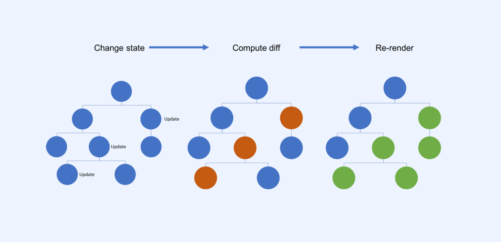

This is the second part of a series on migrating existing native apps to React Native. Check out [the first blog post](https://medium.com/leoilab/converting-an-app-to-react-native-why-and-how-b56c02c07b96) if you want to know why we went for React Native and how we approached it.

## React Native under the hood, a crash course

To understand how React Native works on mobile, you first need to look at the virtual DOM (Document Object Model) that is used in both React and React Native. If you’ve ever done web development, you know how the DOM works in the browser. If not, you might be interested in [reading up on it](https://developer.mozilla.org/en-US/docs/Web/API/Document_Object_Model/Introduction). In short: The DOM represents a page as nodes and objects. In plain React, [the virtual DOM](https://reactjs.org/docs/faq-internals.html) is an in-memory representation of the UI on top of the actual DOM. When a node or object changes, React will diff the virtual DOM and the actual DOM, and only update those nodes or objects that have changed. In React Native, there is no browser DOM. Instead, the virtual DOM is rendered into native iOS or Android views.

While you write plain JavaScript and JSX (tag syntax that is an extension to JavaScript) to define how your React Native app should look and behave, the UI is still rendered natively. Whenever there is a change in one of the nodes or objects, React Native will update the relevant parts of the UI automatically.

This is what sets React Native apart from other cross-platform solutions. Rendering native components significantly speeds up interaction with the app, and while this also introduces some complexities (sometimes you will need to create a custom UI component), for us, it was definitely a good trade-off.

## Navigation is hard

Navigation has always been a bit of a problem on React Native, but the vast amount of packages that are available show that this area is under development. Ideally, Facebook would create or, at least, recommend one solution. But for now, that’s not the case, and we all have to choose a third party library and stick with it. For us, the main contenders were [react-navigation](https://github.com/react-navigation/react-navigation) and [wix/react-native-navigation](https://github.com/wix/react-native-navigation). The first is very flexible and runs everything purely in JavaScript, while the second one is based on native navigation on both platforms. We decided to go with react-native-navigation because we felt like native components would make the app feel more familiar to our users.

*EDIT FROM JANUARY 2019: the native feel of react-native-navigation didn’t make up for the amount of Android bugs, tight coupling with screen components, and non-declarative API. We [migrated to react-navigation](https://twitter.com/kenneth_skovhus/status/1076186546322243584).*

## Getting used to JavaScript

#### JavaScript? No, thanks

In mobile development circles, most people cringe at the thought of writing an entire app in JavaScript. Why would you even do such a thing? JavaScript has a lousy reputation, and rightfully so. If you worked with JavaScript a decade ago, you likely had a horrible experience. Suitable for small scripts on websites, but not ideal for developing an application of any significant size.

However, things have changed, and over the last ten years there have been significant development efforts in tooling, frameworks, and engines. We saw the creation of [jQuery](https://jquery.com/), [V8](https://developers.google.com/v8/), [Node](https://nodejs.org), [Backbone](http://backbonejs.org/), … All of these efforts propelled JavaScript into one of the most used languages in the world. Today, Google’s [Angular](https://angularjs.org/) and Facebook’s [React](https://reactjs.org/) are the two most popular JavaScript frameworks. They are used by Google and Facebook themselves and provide a solid foundation for app development.

#### Modern JavaScript

JavaScript itself also saw significant advances in the last few years. When [EcmaScript 6](http://www.ecma-international.org/ecma-262/6.0/) came out, developers finally had access to features that were already common in most modern programming languages, such as classes, arrow functions (aka lambdas), string interpolation, `let` and `const`, and [many more](https://github.com/lukehoban/es6features). Meanwhile, [CoffeeScript](http://coffeescript.org/) and [Babel](https://babeljs.io/) pioneered [transpilation](https://scotch.io/tutorials/javascript-transpilers-what-they-are-why-we-need-them) so everyone could start using new language features that were not yet implemented by all browsers or engines. ES 7 and 8 kept on advancing the language significantly, and by now we can say that JavaScript can be a very nice language to work with.

Of course, it’s not all sunshine and rainbows. While the language itself is getting better, it is still difficult to set up a good development environment. Because of the dynamic nature of the language, doing something as simple as renaming a variable can still be a challenge. Coming from Android, you might find JetBrains’ [IntelliJ](https://www.jetbrains.com/idea/) useful, because of its familiarity. Web developers tend to stick with editors like [VSCode](https://code.visualstudio.com/) or [Atom](https://atom.io/) when they go to React Native. As long as the plugins are there to support what you need, you can use any editor you want.

We found that a lot of JavaScript’s shortcomings can be countered with internal coding conventions and a good tooling setup to enforce them. Once you get into the habit of writing good, idiomatic JavaScript in a proper architecture, it becomes quite nice, even when you come from Swift or Kotlin in native land.

## Tooling

After we understood how React Native works and decided to make peace with JavaScript, we wanted to make sure we had the right tooling set up to enforce best practices, and that the native developers on our team are made aware when they write non-idiomatic JavaScript. The setup, with a variety of tools from the JavaScript and React ecosystem, also helps us write more maintainable code that is easier to read.

#### Static analysis and code consistency

The dynamic and loosely-typed nature of JavaScript makes it especially prone to runtime errors. To help us find these errors before running the app, we use [ESlint](https://eslint.org/). ESlint also helps us see dead code and detect problematic patterns that sneak into the codebase. Our configuration is based on the widely used [eslint-config-airbnb](https://www.npmjs.com/package/eslint-config-airbnb).

Although ESlint can also check that a codebase adheres to a specific style guideline, we strongly believe that a code style should be enforced by a tool. Instead of debating over coding style, we use [Prettier](https://prettier.io/docs/en/why-prettier.html) to format our code. It [integrates](https://github.com/prettier/eslint-plugin-prettier) with ESlint, so when hitting save in our editor the code is formatted and statically analyzed.

#### State management

For state management, we enjoy the simplicity and testability of [Redux](https://redux.js.org/). We use the [redux-persist](https://github.com/rt2zz/redux-persist) middleware to read and write parts of our Redux store to disk.

#### Static type checking

We started rebuilding the application in React Native without types. But as the application grew, it became clear that a static type checking tool like Flow or TypeScript would help us refactor and discover bugs. The more of the codebase we covered with types, the more bugs we uncovered.

TypeScript by Microsoft and Flow by Facebook are similar tools, providing gradual static typing capabilities, a similar syntax, and widespread usage.

For React Native, Flow was a natural choice. It integrates nicely with the build tool, and most third-party libraries already provide Flow types.

*EDIT FROM JANUARY 2019: After TypeScript gained more momentum, we decided to give TypeScript another change. We migrated most of our projects to TypeScript and didn't look back. The editor support and the library support is 👌*

A type checker is not a silver bullet, though. The learning curve is steep, and you find yourself fighting the type system. But we are happy that a lot of development is happening in this area. One of the most promising options for the future is [Reason](https://reasonml.github.io/) (also by Facebook), a type-safe language build on top of OCaml which compiles to very readable JavaScript.

#### Storybook as a productivity booster

Storybook is a UI development environment for your UI components. With it, you can visualize different states of your UI components and develop them interactively.

If we were to dream up a productive setup for developing UI components and screens, it would:
- Work on components and screens in isolation without starting the entire application
- Be able to describe and quickly switch between components and screens in different states
- Support hot reloading when styles and markup changes
- Have multiple simulators and cross-platform devices connected and see them all update when updating the code</li></ul>
We are happy to see that [Storybook](https://storybook.js.org) delivers all of these. It is a major productivity booster when developing UIs.

#### Automated testing

For unit and integration testing, we are using [Jest](https://facebook.github.io/jest/)—another great open source tool by Facebook. It provides a testing framework with excellent watch mode, coverage support, fairly simple mocking and swift feedback when writing tests. As it runs in Node, you mock out all native components (though it requires some [setup](https://github.com/facebook/react-native/blob/1490ab12ef156bf3201882eeabfcac18a1210352/jest/setup.js)).

We have experimented with Appium and Amazon Device Farm for cross-platform UI automation tests. But currently, we’re focusing on a solid and fast unit testing setup that helps us catch bugs and documents the expected behavior of our code.

#### Editor support

Everyone on the team uses their preferred editor, whether it be Visual Studio Code, Atom, or IntelliJ IDEA. To have a good and consistent development experience we ensure that all of our editors:

- Show ESlint errors
- Call eslint  \-\- fix on file save (we never do manual formatting, we have Prettier for that)
- Understand Flow declarations, so we get autocompletion and type errors in the editor

## What’s next?

While we are quite happy with the current setup, there is room still for improvement. One thing we want to do is to have a big set of UI tests. We’re not entirely sure yet what the best option for that would be. But in general, we now have a solid foundation on which we can build more features, and we have great checks in place that make sure our code adheres to best practices and our internal style. The development cycle is also a lot faster because of the unit tests and Storybook.

There is one more thing we feel is important when converting to React Native, and that is native modules and UI components. We will cover that in our next blog post.

----

*Co-authored by [Kevin Pelgrims](http://www.kevinpelgrims.com/).*

*This blog post were originally posted on [Leo Innovation Labs' medium](https://medium.com/leoilab/converting-an-app-to-react-native-how-to-get-started-924548ff6c62).*
